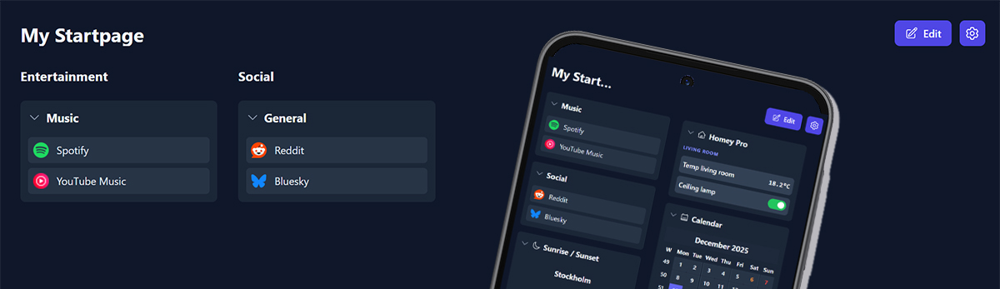

<div align=center></div>

# StartPanel

A lightweight personal start page written in **TypeScript**, built with **Vite**, and designed to be fast, clean, and fully customizable.  
Local preferences are stored directly in your browser, so no external database or backend is required.

The rest of this documentation is written in **Swedish**.

---


# StartPanel – Webbaserad start- och dashboardsida

Detta är en webbaserad start-/dashboardsida gjord i **TypeScript** med stor hjälp av Google AI Studio.  
Och det är en **öppen källkod**.

> **Obs:** Detta är *inte* en officiell Homey-app, utan något jag byggt för privat bruk egentligen.

Det är en kombination av **startpage och dashboard** där du kan samla länkar och olika widgets.  

## Integration med Homey Pro 2023

För att använda den mot Homey Pro 2023, använder du antingen webhooks eller kör appen lokalt på din dator eller på en NAS.  
Du kan se status och styra enheter direkt från sidan (beroende på hur du kör appen).

---

## ⭐ Hur du kan använda sidan

Det finns två sätt att köra den, beroende på vad du vill göra och vilken funktionalitet du behöver.

---

## 1. Kör direkt från GitHub Pages (enklast)

Gå bara till adressen:

👉 **https://nicce70.github.io/StartPanel/**

Det här är det absolut enklaste sättet att använda sidan.

**Begränsningar när du kör via GitHub Pages:**

- Du kan **bara styra Homey via webhooks**
- Du kan **inte läsa tillbaka status** från Homey
  (Homey kräver att webbsidan körs lokalt i samma nätverk för detta)

Allt annat i appen fungerar som vanligt.

---

# OBS!
Sättet nedan kräver att du också plockar ut en PAT-kod (API-nyckel) från din Homey Pro via:  
Inställningar > API-nycklar - + Ny API Nyckel. Kopiera den och spara, den ska klistras in i appen Settings > Homey > Personal Access Token.

- Och värt att tillägga, enbart Polling fungerar i dagsläget, dvs den hämtar all data från Homey med jämna mellanrum (som du anger), så det blir tyvärr ingen Live uppdatering vilket kräver WebSocket (wss) via proxy, något som i nuläget inte är implementerat.

---

## 2. Köra på en NAS (med en webserver som Apache eller liknande)

Om du vill köra sidan på en NAS (t.ex. Asustor, Synology, QNAP) måste du använda de kompilerade HTML/JavaScript-filerna.

De färdiga kompilerade filerna ligger här i GitHub-repot:
👉 /docs (det är samma innehåll som normalt hamnar i “dist/” efter en build)

Det här är viktiga skillnaden:

- NAS:ens server kan inte köra okompilerad TypeScript eller utvecklingskod, den kan bara servera färdiga statiska filer (HTML, JS, CSS), därför måste man använda den kompilerade versionen som ligger i mappen /docs. Det är dessa filer Apache/Nginx använder för att köra sidan (index.html & mappen /assets)

⭐ Måste jag vara i samma nätverk som Homey?

Ja – om du vill både styra och läsa status.

Undantag:
Om du använder VPN funkar allt fullt ut var du än är, för det blir som att du kör lokalt.

⭐ Funktioner

Favoritlänkar med grupperingar

Widgets: väder, radio, tid, kalender m.m.

Backup/export av all konfiguration (sparas lokalt i webbläsaren)

Homey-integration: styrning, status, enhetslistor

---

## Instruktioner för att köra StartPanel på en NAS (Apache, Nginx, Asustor, Synology, QNAP)

0. **Du måste ha en webserver aktiverad på din NAS** - har du inte redan det, hoppa ner till separata instruktioner för detta längre ner!

1. Öppna projektets GitHub-sida https://github.com/Nicce70/StartPanel och gå till mappen som heter “docs”. Det är där de färdiga kompilerade filerna ligger. Detta är samma filer som normalt hamnar i “/dist” när man gör en build, men de finns redan färdiga i “/docs”.

2. Ladda ner filerna från mappen “/docs” till din dator. Det du behöver är:

index.html och hela mappen “assets” (med alla JavaScript-, CSS- och bildfiler)

3. Logga in på din NAS och öppna den webserver du använder (t.ex. Apache eller Nginx). 
På de flesta NAS finns en mapp som heter “web”, “www” eller liknande där man placerar webbfiler.

Kopiera filen index.html och hela mappen /assets till webserverns katalog på din NAS. Det är mycket viktigt att både index.html och mappen /assets ligger på samma nivå i samma mapp, alltså tillsammans sida vid sida.
(Byt inte namn på index.html — den måste heta exakt så för att webbsidan ska fungera som förväntat.)

Strukturen i webbkatalogen ska alltså se ut så här:
```
/web
├── index.html
└── assets/
   └── (alla JS/CSS/bilder)
```

4. När filerna ligger på plats, öppna webbläsaren och gå till adressen för din NAS webbserver, till exempel:  
http://din-nas-ip-adress/

eller om du lade filerna i en undermapp:  
http://din-nas-ip-adress/StartPanel/

5. Sidan ska nu starta direkt från NAS:en. Alla funktioner som inte kräver Homey kommer att fungera direkt.

6. Om du vill använda Homey-integration (styra enheter och hämta status) måste du befinna dig i samma nätverk som din Homey Pro. Alternativt kan du använda VPN. Då fungerar allt på samma sätt som om du var hemma.

7. Alla inställningar och favoritlänkar du skapar sparas automatiskt i webbläsaren via LocalStorage. Det innebär att inställningarna är unika för varje webbläsare och enhet du använder. (Du kan göra backup och läsa in den filen i en annan webbläsare)

8. Webhooks fungerar även om du inte är i samma nätverk som Homey, men att läsa status och enhetsvärden kräver att webbsidan körs lokalt på samma nätverk eller via VPN som sagt.

---

## INSTALLERA EN WEBSERVER PÅ DIN NAS

**Så här startar du en webserver på din NAS (generella instruktioner)**

De flesta NAS-enheter kan köra en enkel webbserver som låter dig visa statiska webbsidor (HTML, CSS, JavaScript). Det är allt som behövs för StartPanel. Så här gör du oavsett NAS-modell:

1. **Logga in i din NAS administrativa webbpanel via webbläsaren** (t.ex. http://din-nas-ip-adress:5000 eller http://din-nas-ip-adress:8000 beroende på modell).

2. **Öppna NAS:ens app-/paketcenter.**
Sök efter någon av följande:
```
“Web Server”
“Apache”
“Nginx”
“Web Station”
“Hosting”
“WWW Server”
```
3. **Installera webservern med standardinställningar.**
På vissa NAS-modeller aktiveras även PHP eller MySQL, men det behövs inte för denna app — du kan ignorera alla sådana extra funktioner.
När webservern är installerad finns det alltid en webbmapp där du ska lägga dina filer. Den brukar heta något i stil med:
```
/web
/www
/var/www
/home/www
/WebServer
/volume1/web (Synology)
```
Webbmappen är den katalog som webservern visar när du går till din NAS IP-adress i webbläsaren.

4. **Starta om webservern via NAS kontrollpanel** (ofta heter det “Restart Service”).

5. **Klart!**
Din NAS kör nu en lokal webbserver, nu kan du återgå till att installera själva appen StartPanel enligt tidigare punkt på din NAS.

Tips:
Om du vill komma åt sidan även utanför hemmet kan du använda VPN.

---

# 📌 FAQ (vanliga frågor)

## ❓ Hur synkar jag dashboarden mellan flera enheter?

Dashboarden sparas lokalt i webbläsaren (LocalStorage) och lagras inte i molnet.
Det är ett privacy-first designval, så man får helt enkelt kopiera settings filen till en ny webbläsare manuellt.

Så här gör du:

1. Settings > Backup & Restore

2. Tryck Export Data → ladda ner JSON-filen

3. Flytta filen till en annan enhet (t.ex. iPad)

4. På andra enheten: Settings > Backup & Restore > Import Data

Klart ✔  
Se till att göra Backup ofta! Och förvara filen utom räckhåll från obehöriga då den inte är krypterad! 
 
## ❓ Kan dashboarden synka automatiskt?

Inte i nuläget.
Auto-sync skulle kräva molnlagring, konto eller någon extern backend — och projektet är byggt för att fungera helt lokalt, utan server, utan login och utan att spara användarens data någonstans.
 
## ❓ Innehåller backupfilen känsliga uppgifter? (t.ex. Homey PAT-tokens)

Backupfilen kan innehålla:

- din dashboard-layout
- widgetkonfigurationer
- eventuella tokens (t.ex. Homey PAT)

Det är ingen säkerhetsrisk i sig, men filen bör hanteras som en personlig konfigurationsfil:

- lagra den på en trygg plats
- undvik att skicka den okrypterat
- dela den inte om du inte vill dela din setup

Detta är en del av projektets integritetsvänliga upplägg — ingen information skickas till molntjänster eller tredje part.
 
## ❓ Varför sparas inget i molnet?

För att:

- kunna köras helt offline
- undvika konton / login / backend
- ge användaren full kontroll över sina data
- undvika molnberoenden (t.ex. tjänster som läggs ner)

Dessutom passar det bra ihop med Homey-användares generella preferens att äga sin setup med egen hårdvara.  
Med detta sagt är det <b>extra viktigt</b> att du gör backup regelbundet, för din webbläsare kan tappa inställningarna vid en uppdatering, crash, app-uppdatering osv!
 
## ❓ Måste jag köra lokalt på en NAS?

Nej — men det ger fler funktioner.

Körsätt -	  Funktioner  
GitHub Pages -   Webhooks (skicka kommandon)  
Lokalt / NAS -   Läsa sensorer + styra enheter (polling)  
 
## ❓ Fungerar den bara med Homey Pro 2023/2026?

Ja när polling används (läsa / skicka). Med enbart Webhook (skicka på vinst och förlust) kan det fungera med äldre modeller.  
Det behövs nämligen en API (PAT) kod, och det har bara Homey 2023 Pro och nyare.

## ❓ Varför syns bara en bokstav och inte ikonen till länkarna ibland?

Det sporadiska beteendet du ser beror på flera faktorer som är utanför appens direkta kontroll:  
- Tjänsternas Cache: Ikon-tjänsterna har sin egen "cache" (ett temporärt minne). Om en tjänst misslyckas med att hämta en ikon en gång, kan den "komma ihåg" det misslyckandet ett tag. När deras cache sedan uppdateras (vilket kan ta timmar eller dagar), kan ikonen plötsligt dyka upp igen. Samma sak gäller omvänt – en fungerande ikon kan försvinna om tjänstens cache av någon anledning blir korrupt.
- Tillfällig Otillgänglighet: Tjänsterna vi använder kan ha korta avbrott eller vara överbelastade. Om appen försöker hämta en ikon precis under ett sådant avbrott, misslyckas det. Nästa gång du laddar sidan kan tjänsten fungera igen.
- Webbplatser som blockerar: Vissa webbplatser gillar inte att automatiska tjänster hämtar deras ikoner och kan blockera dem. Detta kan ändras över tid.
- Din webbläsares cache: Även din egen webbläsare har en cache. Den kan ibland hålla kvar en trasig bildfil eller ett misslyckat försök att ladda en bild, vilket gör att ikonen inte visas förrän cachen rensas eller uppdateras.

## ❓ Är detta en officiell Homey App?

- Nej, och den har begränsad Homey integration


---

Besök [StartPanel på GitHub Pages](https://nicce70.github.io/StartPanel/) för att testa appen live!


